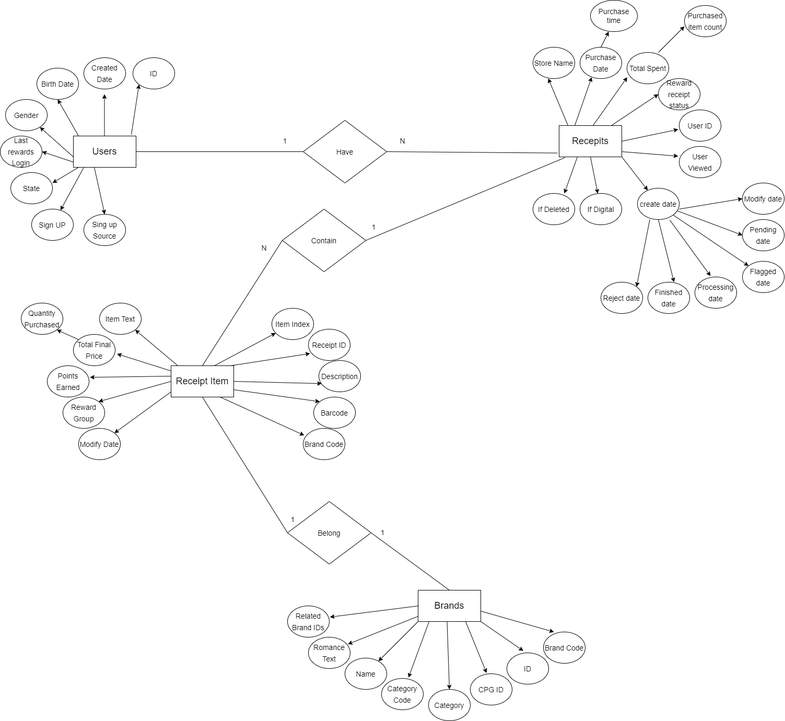
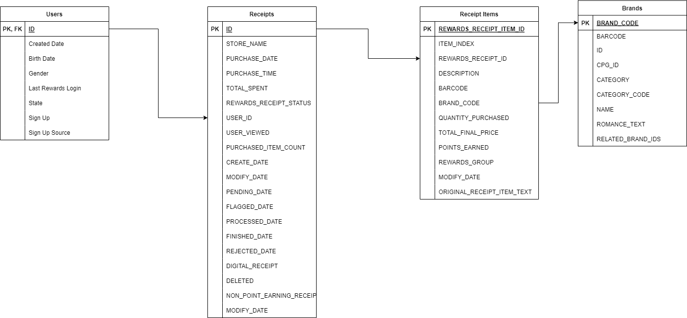
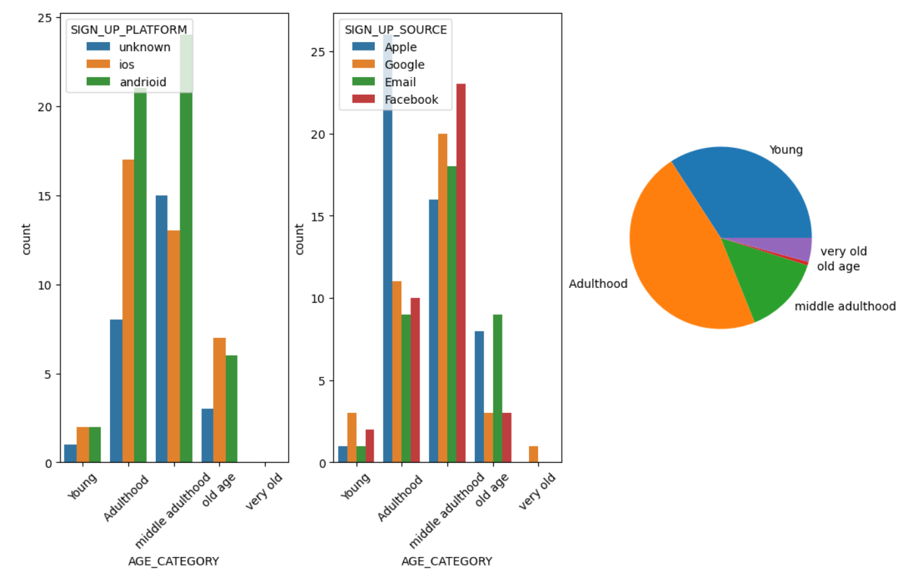
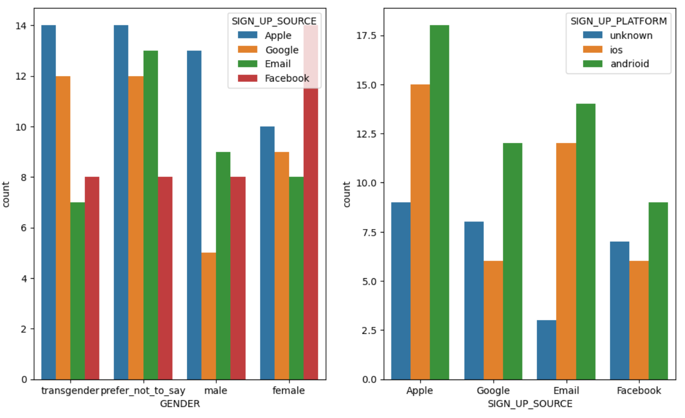

# ERD & RDM

# Analysis Plot

# Observations
1). we can see that female user prefer using facebook to sign up, whereas other user prefer Apple.
2). Andriod users are more than other platform
3). Most user at adulthood category prefer using Apple to sign up, whereas user at middle adulthood prefer Facebook
4). From the pie chart and the other plot, we could say that users at adulthood and middle adulthood are much more than other other age group
